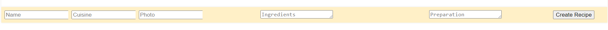
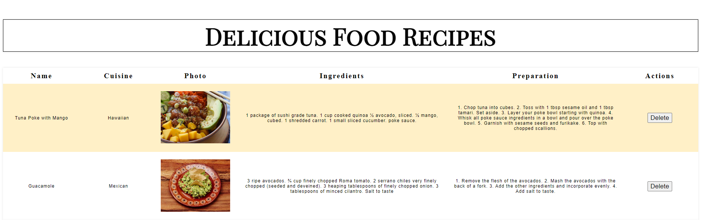

# Recipe CRUD App

This project is a simple recipe-tracking app that allows users to add, view, and delete recipes. It is built using React and styled according to the provided mockup. The app manages the state for the list of recipes and uses various React components to organize the structure and functionality.

## Technologies Used

- **React**: JavaScript library used to build the user interfaces, efficient component-based architecture and state management.
- **HTML5**: Used for structuring the app's layout and content.
- **CSS3**: Used for styling the components to match the mockup and implement responsive design.
- **JavaScript (ES6+)**: Used to implement the core functionality of the app, including handling state, event listeners, and dynamic updates.
- **Node.js**: Required for running the development server and managing the project's dependencies.
- **npm**: The package manager used to install and manage project dependencies.
  
## Features

- **Create a Recipe**: Users can create a new recipe by filling out a form that includes fields for the recipe name, cuisine, photo URL, ingredients, and preparation instructions.
- **Read Recipes**: The app displays a list of all the recipes, showing the name, cuisine, photo, ingredients, and preparation instructions in a table format.
- **Delete a Recipe**: Users can delete a recipe by clicking the "Delete" button associated with each recipe entry.
- **Styling**: The app is styled based on the mockup requirements and includes features such as zebra-striped rows, column width adjustments, and scrollbar behavior for lengthy content.

### External Libraries
- **Google Fonts**: The 'Playfair Display SC' and 'Open Sans' fonts are imported from Google Fonts for typography styling.


## Setup

### Prerequisites

Ensure you have **Node.js version 18** installed before running the app. You can check your Node version using the following command:

```bash
node -v
```
If you need to switch to Node version 18, use:

```bash
nvm use v18
```
### Installation
1. Clone the repository to your local machine.
2. Navigate to the project directory.
3. Install the dependencies:
```bash
npm install
``` 
### Running the App
To start the development server:
```bash
npm start
```
The app will be available at `http://localhost:3000`.

## Functionality
### Creating a Recipe
To create a recipe, fill out the form fields:

- **Name**: The name of the recipe.
- **Cuisine**: The type of cuisine the recipe belongs to.
- **Photo URL**: A URL pointing to an image of the dish.
- **Ingredients**: List the ingredients in a `<textarea>` field
- **Preparation**: Describe the preparation steps in a `<textarea>` field.
When the form is submitted, the new recipe will be added to the end of the list.



### Displaying the Recipes
The recipes are displayed in a table format:

- Columns include the name, cuisine, photo, ingredients, and preparation instructions.
- The preparation and ingredient columns have scrollbars if the content exceeds the column height.



### Deleting a Recipe
Each recipe row includes a "Delete" button. Clicking the button removes the recipe from the list.

## Styling
The app's styles are defined in `App.css`. Key points include:

- The header text (`<h1>Delicious Food Recipes</h1>`) uses the **'Playfair Display SC'** font, is centered, and has a font size of **64px**.
- The table columns are sized using the CSS `nth-child`pseudo-class:
  -- Preparation and ingredients columns are set to **30%** width.
  -- Other columns are set to **10%** width.
- Zebra striping for table rows is implemented using `nth-child(odd)`.
- Images are scaled using the `object-fit: scale-down` property, with a width and height set to **100%**.
- Long text in the ingredients and preparation columns is wrapped and scrollable using the `.content_td` class.

## Project Structure
 - **App.js**: The main component that manages state and renders `RecipeList` and `RecipeCreate` components.
 - **RecipeCreate.js**: A component containing the form to create a new recipe. This component includes handlers for form submission and input changes.
 - **RecipeList.js**: A component that displays the list of recipes in a table. It includes a "Delete" button for each recipe.
 - **RecipeData.js**: A file containing the initial set of recipes.
